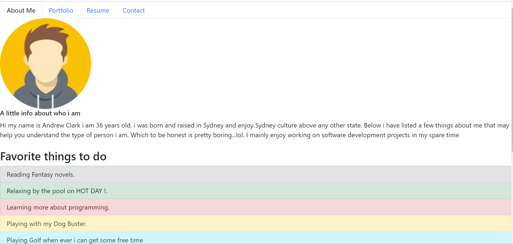

# My Portfolio

  

   
  

  ## Description
  This Application showcases my projects and my experiances learnt while doing the FUll stack web development course. It also provides my resume and also a contact form to get in touch with me
  

   

## License
  
    Copyright 2023 Andy316C Licensed under the Apache License, Version 2.0 (the 'License'); you may not use this file except in compliance with the License. You may obtain a copy of the License at http://www.apache.org/licenses/LICENSE-2.0 Unless required by applicable law or agreed to in writing, software distributed under the License is distributed on an 'AS IS' BASIS, WITHOUT WARRANTIES OR CONDITIONS OF ANY KIND, either express or implied. See the License for the specific language governing permissions and limitations under the License.

   
  
  ## Table of contents
  <ol>
  <li><a href='#title'>Title</a></li>
  <li><a href='#desc'>Description</a></li>
  <li><a href='#install'>Installation</a></li>
  <li><a href='#cont'>Contribution</a></li>
  <li><a href='#test'>Testing</a></li>
  <li><a href='#images'>Images</a></li>
  <li><a href='#questions'>Questions</a></li>
  <li><a href='#contact'>Contact Info</a></li>
  </ol>
   

  

  ## Installation
  The application required multiple npm packages for successfull deployment, the pacakages required for the command requests, axios, multiple react packages

  

   

  

  ## Contribution Guidelines
  No updates required
  

   

  

  ## Testing
  Select any of the Navigation tabs to view the selected option
  

 
  

   
   

  ## Images
  My Portfolio Page
  
   

  
  
  

   
  
  

  
  ## Questions
  
  For questions or information please Email the following email address with your questions or concerns.
   

  Company Name: 
  Global Software CMS INC
   

  Company Email:  
  GlobalSoftwareCMSINC@gmail.com
  

   

  
  ## Contact Info
  Developers Name:  
  Andrew Clark
   

  Developers Email:  
  andy@gmail.com

  

   

 

## Github Page

Click below to visit the page:

<a href= "https://andy316c.github.io/CurrentPortfolio/">portfoilio Page </a>

   

  